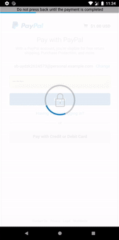
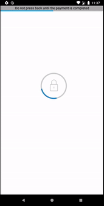

# PayPal IAP for Android


An unofficial PayPal In-App-Purchase library for Android apps. Using this you can easily accept payments within your Android app.

> _The library source is hidden to protect it from anti-tampering._

> _If you are likely publishing your app to Google Play. It is recommended **not to use** any other payment method other than their official one. There is a high chance your app might get banned._

> _It is always good to have other IAP methods._ ❤️

## FAQ

### Q. How is this different from the [offical](https://github.com/paypal/PayPal-Android-SDK)?

Well, for starters the repository has no long term support but its ok since it still works. The main problem with direct payments are they don't return `user details` as this library does.

Also it doesn't accept `credit card` purchase which is possible by using PayPal buttons. [XDA Labs](https://play.google.com/store/apps/details?id=com.xda.labs.play) uses their own implementation of such process.

### Q. Can you steal our credentials?

If you are thinking that I might steal your credential during payment process, then I must say this is technically not possible with only having "Internet" permission in manifest (also I don't care).

## Download

Library is available on `mavenCentral()`

```groovy
implementation 'io.github.kaustubhpatange:paypal-iap:$version'
```

## Usage

For more information on how to use this payment mode, check the [sample](sample/) provided in this Github repo. A basic workflow is shown below.

- Each IAP is basically a Paypal button, so you first need to create it by following this [guide](https://github.com/KaustubhPatange/PayPal-IAP-for-Android/wiki/Creating-PayPal-buttons).

### Checkout (Single payment only)

- You will need a `button Id` & `redirect url` which you have created in above step. Create an `Options` from `Options.Builder` class with this information.

```kotlin
val options = Paypal.Options(
    paypalButtonId = "button-id",
    purchaseCompleteUrl = "redirect-url",
    isSandbox = true // Set this to false to accept live payments
)
```

- Initialize `PayPal` class using `PayPal.Builder` class where you need to pass this `option` as constructor parameter. This class will be responsible for payment checkout.

_Note: Each instance of `PayPal` class can hold one `button Id` only._

```kotlin
private lateinit var paypal: Paypal

paypal = Paypal.Builder(options)
            .setCallingContext(this) // Activity or Fragment
```

- Start your checkout process.

```kotlin
paypal.checkout(
    closeOnCheckout = false, // See this parameter behavior at the bottom of this guide.
    onCheckOutComplete = { details ->
        Toast.makeText(this, "Completed with ${details?.email}", Toast.LENGTH_SHORT).show()
    },
    showCloseDialog = true, // (Optional) default true
    showDoNotCloseInfo = true, // (Optional) default true
    showProgressBar = true // (Optional) default true
)
```

### Detect completion or cancellation

- You need to override `onActivityResult` method as follows.

```kotlin
override fun onActivityResult(requestCode: Int, resultCode: Int, data: Intent?) {
    super.onActivityResult(requestCode, resultCode, data)

    if (paypal.isPurchaseComplete(requestCode, resultCode)) {
        val details = data?.getSerializableExtra(Paypal.PURCHASE_DATA) as? Paypal.History
        // Do something after purchase complete.
        // ...
    } else if (paypal.isPurchaseCancelled(requestCode, resultCode)) {
        // Do something after purchase cancelled.
    }
}
```

### Anatomy of `closeOnCheckout`

| `closeOnCheckout = false`                                                            | `closeOnCheckout = true`                                |
| ------------------------------------------------------------------------------------ | ------------------------------------------------------- |
| You need to manually click "Return to Merchant" button to trigger purchase complete. | Directly exit payment screen after completing checkout. |
|                                                        |                            |

## Sample

For more information on how to use this payment mode, check the [sample](sample/) provided in this Github repo.

## Requirements

- AndroidX
- Min SDK 19+

## License

- [The Apache License Version 2.0](https://www.apache.org/licenses/LICENSE-2.0.txt)

```
Copyright 2020 Kaustubh Patange

Licensed under the Apache License, Version 2.0 (the "License");
you may not use this file except in compliance with the License.
You may obtain a copy of the License at

   https://www.apache.org/licenses/LICENSE-2.0

Unless required by applicable law or agreed to in writing, software
distributed under the License is distributed on an "AS IS" BASIS,
WITHOUT WARRANTIES OR CONDITIONS OF ANY KIND, either express or implied.
See the License for the specific language governing permissions and
limitations under the License.
```
